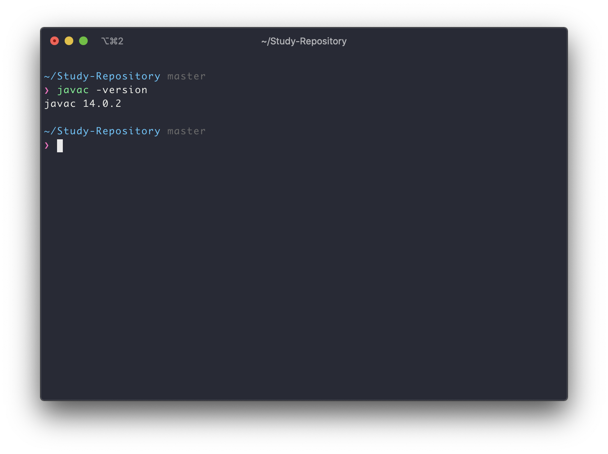
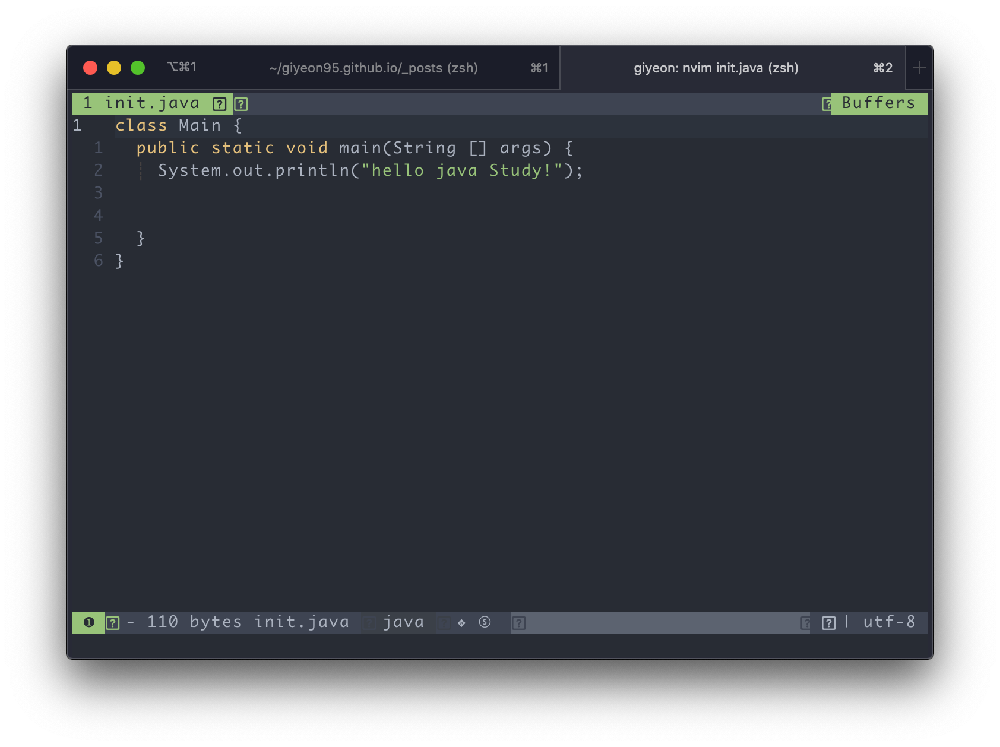

백기선님이 live-study를 진행한다는 글을 보았다.

인프런 Spring 관련 강좌를 아주 잘 듣고 있었고, **JAVA 기본기**를 정리할 좋은 기회가 될것 같아 참여 해본다.


# 목표
* 자바 소스파일(.java)을 JVM으로 실행하는 과정 이해하기.


## JVM 이란 무엇인가?

**정의**
- JVM(Java Virtual Machine)의 줄임말로, JAVA가 OS에 구애받지 않고 재사용을 가능하게 해주는 소프트웨어 구현체

**역할**
1. OS에 구애받지 않고 JAVA가 동작 할 수 있게 해준다.

```text 
    ------------------------------
    |                            |
    |          Program           |
    |                            |
    ------------------------------
                   |
    ------------------------------
    |                            |
    |            JVM             | # JVM이 중간에서 Program과 OS의 중재자 역할
    |                            | # JVM이 없다면? Program은 OS에 의존적
    ------------------------------
                   |
    ------------------------------
    |                            |
    |      Operating System      | 
    |                            |
    ------------------------------
                   |
    ------------------------------
    |                            |
    |          Hardware          |
    |                            |
    ------------------------------
```
2.  메모리 관리 & Garbage collection (GC)
   
```text
- OS 레벨에서의 memory leak 방지
- 프로그램이 동적으로 할당했던 메모리 영역 중 필요 없게 된 영역을 해지하는 기능
```
    
## 컴파일 하는 방법
- 사전준비: JDK (JRE + java compiler) [Download](https://www.oracle.com/java/technologies/javase-jdk15-downloads.html)
- 설치 확인 방법 (mac OS)

```shell script
❯ javac -version
javac 14.0.2
```



**1. java file 만들기**

```java
class Main {
    public static void main(String[] args){
      System.out.println("hello java Study!");
    }
}
```




**2. java 파일 저장 및 byte code 변환**

```shell script
    javac [file-name].java
```

**3. java 실행**

```shell script
    java [class-name]

# file-name이 아닌, class 이름으로 저장됨
# 확장자 .class 는 실행할때 붙혀주지 말것 (30분 삽질함..)
```

 

    


### References
> <https://asfirstalways.tistory.com/158>
>