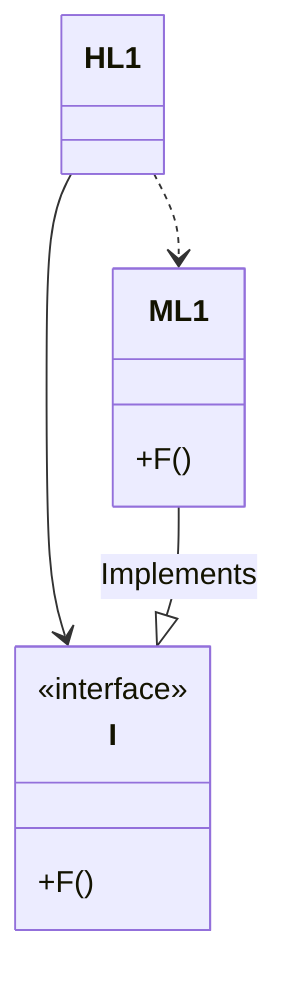

# 3장 패러다임 개요

프로그래밍 패러다임엔 아래 세가지가 존재한다.

- 구조적 프로그래밍(structured programming): 제어흐름의 **직접적인 전환**에 대해 규칙을 부과한다. 
- 객체 지향 프로그래밍(object-oriented programming): 제어흐름에 **간접적인 전환**에 대해 규칙을 부과한다.
- 함수형 프로그래밍(functional programming): 할당문에 대해 규칙을 부과한다.

각 패러다임은 프로그래머에게서 권한을 박탈하며, 일종의 추가적인 규칙을 부과함으로서 **무엇을 해야하면 안되는지를 말해준다.**

# 4장 구조적 프로그래밍

데이크스트라가 초기에 인식한 문제는 프로그래밍은 어렵고 프로그래머는 프로그래밍을 잘하지 못한다는 사실이었으며, 작은 세부사항을 간과하게 되면 예상 외의 방식으로 실패하고는 했다고 한다. 데이크스트라는 수학자 유클리드 계층 구조를 사용하는 방식을 프로그래머도 사용할 수 있다고 믿었으며, 코드가 올바르다는 사실을 스스로 증명하게 되는 방식이었다.

데이크스트라는 이 연구를 진행하면서 **goto 문장이 모듈을 더 작은 단위로 재귀적으로 분해하는 과정에 방해**가 되는 경우가 있다는 사실을 발견했다. 항상 문제가 된 것은 아니지만, 이러한 **goto문의 방식보다는 if/then/else 와 do/while과 같은 분기와 단순 제어구조에 해당한다는 사실**을 발견했다고 한다.

이런 제어구조는 뵘과 야코피니가 데이크스트라 보다 2년 먼저 발견했는데 모든 프로그램을 **순차, 분기, 반복**이라는 세가지 구조만으로 표현할 수 있다는 사실을 증명했다. 즉 모든 모듈을 증명 가능하게 하는 바로 그 제어구조가 모든 프로그램을 만들 수 있는 최소 집합과 동일하다는 사실이었다.

## 기능적 분해

- 구조적 프로그래밍을 통해 모듈을 증명 가능한 더 작은 단위로 재귀적으로 분해할 수 있게 되었으며, 기능적으로 분해할 수 잇음을 뜻했다 즉, 거대한 문제 기술서를 받더라도 **고수준의 기능들로 분해할 수 있다.** 그리고 이들 각 기능은 다시 **저수준의 함수들로 분해**할 수 있고, 이러한 분해 과정을 끝없이 반복해볼 수 있다.

## 테스트

- 데이크스트라는 테스트는 버그가 있음을 보여줄 뿐 버그가 없음을 보여줄 수는 없다고 말한적이 있다.
- 즉 **모든 테스트가 통과한다고 해서 프로그램이 맞다고 증명할 수는 없다. 그러나 목표에 부합할 만큼은 충분히 참이라고 여길 수 있다.**
- 즉 올바르지 않음을 증명하는데 실패함으로써 올바름을 보여준다.

# 5장 객체 지향 프로그래밍

이 장에서는 좋은 아키텍처를 만드는 일은 객체 지향 OO설계 원칙을 이해하고 응용하는 데서 출발한다고 한다. OO의 본질을 설명하기 위해서는 세가지 개념이 나온다고 한다.

- 캡슐화
- 상속
- 다형성

## 캡슐화

데이터와 함수를 쉽고 효과적으로 캡슐화 하는 방법을 OO 언어가 제공한다. private으로 바깥에서는 데이터 은닉이 가능하나, 이러한 개념은 OO에만 한정된 것이 아닌 C 언어에서도 `#include` 를 통해 캡슐화가 가능하다. 즉 OO가 강력한 캡슐화에 의존하고 강제한다는 주장은 받아들이기 힘들며, **OO프로그래밍은 프로그래머가 충분히 올바르게 행동함으로써 캡슐화된 데이터를 우회해서 사용하지 않을 거라는 믿음을 기반으로 한다.**

## 상속

상속만큼은 OO 언어가 확실히 제공했다고 한다. 그러나 이전에도 C 프로그래머는 언어의 도움 없이 손수 이러한 방식으로 구현할 수 있었다. 그러나 이방식은 상속을 흉내낸 것이지, 상속만큼 편리한 방식은 절대 아니었다고 한다.

## 다형성

OO 언어가 있기 이전에도 다형성을 표현할 수 있는 언어가 있었다. OO언어는 다형성을 제공하지는 못했지만 다형성을 좀 더 안전하고 더욱 편리하게 사용할 수 있게 해준다.

### 의존성의 역전

다형성을 안전하고 편리하게 적용할 수 있는 메커니즘이 등장하기 전 소프트 웨어는 main 함수가 고수준 함수를 호출하고, 고수준 함수는 중간 수준 함수를, 중간 수준 함수는 저수준 함수를 호출하였으며, 이러한 호출 트리에서 소스 코드 의존성의 방향은 반드시 제어흐름을 따랐었다. 

  classDiagram

	Main --> HL1
	Main --> HL2
	Main --> HL3
	HL1 --> ML1
  HL1 --> ML2
  HL1 --> ML3
  ML1 --> LL1
  ML1 --> LL2
  ML2 --> LL3
  ML2 --> LL4
  
  
  Main ..> HL1
	Main ..> HL2
	Main ..> HL3
	HL1 ..> ML1
  HL1 ..> ML2
  HL1 ..> ML3
  ML1 ..> LL1
  ML1 ..> LL2
  
  ML2 ..> LL3
  ML2 ..> LL4  

 <의존성과 제어의 흐름을 나타내는 그래프>

하지만 다형성이 끼어들면 아래와 같이 개선이 가능하다.

HL1모듈은 ML1 모듈의 F() 함수를 호출하나, 소스코드에서는 인터페이스를 통해 F()를 호출한다. 하지만, **ML1과 I 인터페이스 사이의 소스코드 의존성은 반대인 점을 주목하자. 이는 의존성 역전 (dependency inversion) 이라고 부른다.**

이러한 현상은 컴포넌트를 개별적이며 독립적으로 배포가 가능하게 만들어준다.

- 특정 컴포넌트의 소스 코드가 변경되면 해당 코드가 포함된 컴포넌트만 다시 배포하면 되는 것을 배포 독립성(independent deployability)라고 한다.
- 시스템 모듈을 독립적으로 배포할 수 있게 되면, 서로 다른 팀에서 각 모듈을 독립적으로 개발할 수 있게 되는데 이를 개발 독립성(independent developability) 라고 한다.

소프트웨어 관점에서는 OO는 아래와 같이 이야기한다.

- OO란 다형성을 이용하여 전체 시스템의 모든 소스 코드 의존성에 대한 절대적인 제어 권한을 획득할 수 있는 능력이다. OO를 사용하면, 아키텍트는 플러그인 아키텍처를 구성할 수 있고, 이를 통해 고수준의 정책을 포함하는 모듈은 저수준의 세부사항을 포함하는 모듈에 대해 독립성을 보장할 수 있다.

# 6장 함수형 프로그래밍

함수형 프로그래밍 패러다임에서 핵심이 되는 기반은 람다 계산법으로 알론소 처치가 1930년대 에 발명했다.

함수형 언어인 클로저(Clojure)는 가변 변수가 전혀 없다. 즉 **함수형 언어에서 변수는 변경되지 않는다.**

## 불변성과 아키텍처

- 경합조건(race condition), 교착상태(dead lock), 동시 업데이트 (concurrent update)의 문제는 모두 가변 변수로 인해 발생한다. 
- 불변성이 현실적으로 실현 가능한지는, 저장 공간이 무한하고 프로세서의 속도가 무한히 빠르다고 전제하면 가능하다.
- 불변성과 관련하여 가장 주요한 타협 중 하나는 애플리케이션, 또는 애플리케이션 내부의 서비스를 가변 컴포넌트와 불변 컴포넌트로 분리하는 일이다.

## 이벤트 소싱

**이벤트 소싱은 상태가 아닌 트랜잭션을 저장하자는 전략이다.** 모든 트랜잭션을 저장하다 보면, 트랜잭션 수는 끝없이 증가하고 컴퓨팅 자원이 크게 필요해진다. 다만 실제로 저장소의 크기는 수 테라바이트도 작다고 여기는 시대가 되었다.

