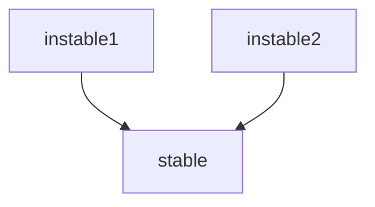
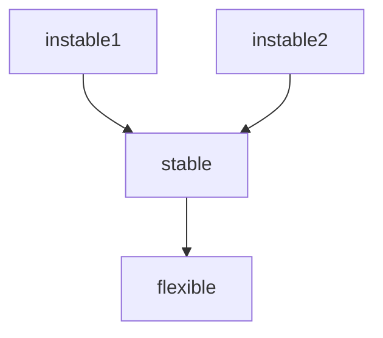

# 12장 컴포넌트

## 컴포넌트?

컴포넌트는 배포 단위이다. (자바는 jar, 루비는 gem 파일을 의미한다.)

잘 설계된 컴포넌트라면 반드시 **독립적으로 배포 가능한, 따라서 독립적으로 개발 가능한 능력**을 갖춰야 한다.

**오늘날의 컴포넌트는 쉽게 사용할 수 있는 지점까지 다다랏다.**

# 13장 컴포넌트 응집도

- REP (Reuse/Release Equivalence Principle): 재사용/릴리스 등가원칙

- CCP (Common Closure Principle): 공통 폐쇄 원칙

- CRP (Common Reuse Principle): 공통 재사용 원칙

## REP(Reuse/Release Equivalence Principle): 재사용/릴리스 등가원칙

- **재사용 단위는 릴리스 단위와 같다.**
- 릴리즈 절차와 릴리즈 번호를 부여해야한다.
  - 릴리즈 절차가 없으면 추적 관리되지 않는다.
  - 릴리즈 번호가 없다면, 재사용할 수 없으며, 호환되는지 보증할 수 없다.
  - 새로운 버전이 출시되었을때 변경사항과 사용하는 개발자들이 인지해야한다. (릴리즈 노트 작성은 중요하다.)

- **단일 컴포넌트는 응집성 높은 클래스와 모듈들로 구성되어야 한다.**

## CCP(Common Closure Principle): 공통 폐쇄 원칙

- **동일한 이유로 동일한 시점에 변경되는 클래스는 같은 컴포넌트로 묶어라.**
- 단일 컴포넌트는 **변경의 이유가 여러 개 있어서는 안된다.**
- CCP는 컴포넌트 수준의 SRP 이다.

## CRP(Common Reuse Principle): 공통 재사용 원칙

- 컴포넌트 사용자들을 필요하지 않는 것에 의존하게 강요하지 말라
- 같이 재사용 되는 경향이 있는 클래스와 모듈들은 같은 컴포넌트에 포함되어야 한다.
  - 즉 **다른 컴포넌트를 사용하거나 의존해서는 안된다.**
- CRP는 ISP의 포괄적인 버전으로 **필요하지 않은 것에 의존하지 말라.**

## 컴포넌트 응집도에 대한 균형 다이어그램

REP와 CCP는 포함(inclusive) 원칙으로, 컴포넌트를 더욱 크게 만든다. 반대로 CRP는 배제(exclusive) 원칙으로 컴포넌트를 더욱 작게 만든다. 이 원칙들의 균형을 이루는 방법을 찾아야 한다.

이미지 출처: https://icarus8050.tistory.com/46

오로지 REP와 CRP에만 중점을 두면, 사소한 변경에도 많은 컴포넌트에 영향을 미친다. 반대로 CCP와 ERP에만 과도하게 집중하면 불필요한 릴리즈가 빈번해진다. 프로젝트의 컴포넌트 구조는 시간과 성숙도에 따라 변하며, 프로젝트가 발전되고 사용하는 방법과 더 관련이 있다.

# 14장 컴포넌트 결합

아래 세 원칙은 컴포넌트 사이의 관계를 설명한다.

- ADP (Acyclic Dependencies Principle): 의존성 비순환 원칙
- SDP (Stable Dependencies Principle): 안정된 의존성 원칙
- SAP (Stable Abstractions Principle): 안정된 추상화 원칙

## ADP(Acyclic Dependencies Principle): 의존성 비순환 원칙

- 컴포넌트 의존성 그래프에 순환(cycle)이 없어야 한다.
  - 시스템 전체를 릴리즈 하는 경우, 시스템을 빌드하는 방법 파악이 가능하다.
  - 순환(cycle)이 발생하면, 각 컴포넌트의 개발자들은 서로 얽매이게 되며, 테스트 하기 어려워진다.
  - 순환 끊는 방법은 DIP를 적용함으로서 의존성 역전이 가능하다.

컴포넌트는 시스템에서 가장 먼저 설계할 수 있는 대상이 아니며, 시스템이 성장하고 변경될때 함께 진화된다. 왜냐하면 컴포넌트 의존성 다이어그램은 애플리케이션의 기능을 기술하는 일이 아니라, 빌드가능성과 유지보수성을 보여주기 때문이다.

프로젝트가 확장되고 모듈들이 쌓이다보면, 의존성 관리에 대한 요구가 점차 늘어나며, 이는 SRP(단일 책임 원칙)과 공통 폐쇄 원칙(CCP)에 관심을 갖기 시작한다. 애플리케이션이 점차 성장하게 되면, 재사용가능한 요소를 만드는 일에 관심을 가지게 되며, 이는 공통 재사용 원칙(CRP)이 영향을 미치게 된다.

컴포넌트 의존성 구조는 시스템의 논리적 설계에 발맞춰 성장하며 진화해야한다.

## SDP(Stable Dependencies Principle): 안정된 의존성 원칙

- 안정성의 방향으로 (더 안정된 쪽에) 의존하라.
- 수많은 다른 컴포넌트가 A라는 컴포넌트에 의존하면, A의 의존성은 안정적이라고 볼 수 있다.
  - 변경에 비용이 많이 들며 비용이 어려워진다.

### 안정성 지표

- Fan-in: 안으로 들어오는 의존성
- Fan-out: 바깥으로 나가는 의존성
- I(불안정성): I = Fan-out / (Fan-in + Fan-out) 이며, I=0이면 최고로 안정된 컴포넌트를, 1이면 최고로 불안정한 컴포넌트를 의미한다.

instanble1, instanble2 의 I= 1, stable의 I= 0

즉 stable이 안정성 지표로 안정적이라고 볼 수 있다.

**다만 모든 컴포넌트가 안정적인 시스템이라면, 이는 변경이 불가능한 시스템을 의미한다. 즉 모든 컴포넌트가 안정적이어야 하는 것은 아니다.**

위 컴포넌트에서 flexible은 변경하기 쉽도록 설계한 컴포넌트이다. 그러나 flexible은 안전한 상태(변경하기 어려운) 이기에 이는 SDP를 위반한다. 

아래와 같이 stable 컴포넌트 내부에 U 클래스는 flexible 컴포넌트 내부의 C 클래스를 의존하고 있다고 가정해보고 이러한 문제는 DIP를 도입하여 개선해 볼 수 있다.

그림 출처: https://icarus8050.tistory.com/47

UServer라는 컴포넌트에 US를 넣고, UServer에 양컴포넌트가 의존하게 된다면, Flexible의 안정성 지표는 1으로 불안정성한 상태로 변경해볼 수 있다.

그림 출처: https://icarus8050.tistory.com/47

## SAP (Stable Abstractions Principle): 안정된 추상화 원칙

- 컴포넌트는 안정된 정도만큼만 추상화 되어야 한다.
- 안정된 컴포넌트는 추상 컴포넌트여야 하며, 이를 통해 안정성이 컴포넌트를 확장하는 일을 방해해서는 안되며 불안정한 컴포넌트는 구체 컴포넌트여야 한다.
- 이는 결국 컴포넌트에 대한 DIP 라고도 볼 수 있으며, 의존성은 추상화의 방향으로 흐른다.
